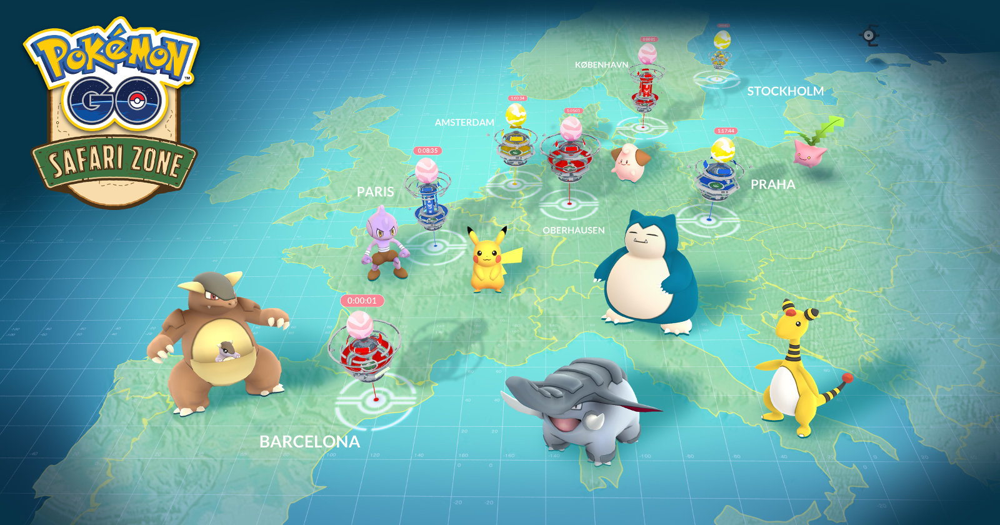

```{r setup, include=FALSE}
if(!require(pacman))install.packages("pacman")
pacman::p_load(knitr)
pacman::p_load(tidyverse)
pacman::p_load(rgdal)
pacman::p_load(sp)

countries <- readOGR("Data", layer = "countries")

conflicted::conflict_prefer("filter", "dplyr")

options(htmltools.dir.version = FALSE,
        tibble.width = 70,
        ggplot2.continuous.colour = "viridis",
        ggplot2.continuous.fill = "viridis")
opts_chunk$set(
  fig.width = 6.5,
  fig.height = 4.5,
  fig.align = "center",
  cache = TRUE
)
theme_set(theme_minimal() +
            theme(text = element_text(size = 20))) 
```

# Topics we'll cover today:

* Types of spatial data
* Importing/Exporting spatial data
* Projections, extents, and units
* Comparison of different GIS tools out there
* Spatial data manipulation
* Intro to spatial analysis
* Visualizations (if we have time)

---
class: inverse, middle, center

#Data types


https://www.gislounge.com/geodatabases-explored-vector-and-raster-data/
  
---
class: inverse, middle, center

# **Vector data**

Equivalent to a spreadsheet with a geometry column that describs how to plot the data that represents that feature
---

### **Polygons**
Two dimentional and are used for measurment of area and paramiters ofa geographical feature. 

---

### **Lines**
One dimentional and are used to only to measure length
---

### **Points**
Used to represent nonadjucent features 

--
# File type

* Polygon and lines come in a shapefile format, point usually are stored in XY table (a spreadsheet with latitude and longitude columns)

* A shapefile is structured from 4 main files: 
 - **shp** - the geometry of each feature
 - **dbf** - a dBase file with the attribute data for each feature (can be opened in excel; stores the metadata of each feature)
 - **prj** - The projection file
 - **shx** - a spatial index that helps a GIS program find the features in the .shp file quickly

**IMPORTANT:** each shapefile can only store one type of geometry - point/ polygon/ line
---
class: inverse, middle, center

# **Raster data**

Cell-based data, represents surfaces. Each cell represents a value
---
## **Two main types**

### **Continuous**
Example: temperature, elevation, etc.

### **Discrete**
Example: population density, species richenss, etc.

---

Rasters have three types of datasets: 

### **Thematic**
Used to represent discrete data, such as soil type or land use
ADD A PICTURE
---
### **Spectral**
Aerial or setalite imagery
ADD A PICTURE
---
### **Surface**
Represents continuous changes across a landscape (for example elevation)
ADD A PICTURE
---

class: center

# Vector and raster comparison
```{r echo=FALSE}
pacman::p_load(flextable,officer)
my_table<- data.frame(Data_type = c(rep("Vector",3),rep("Raster",3)),Pros = c("High geographical accuracy",
"Follows topology rules which increases integrity",
"Used for measurements of proximity","Very good for representing remote sensing data","Performs well with map algebra",""),Cons = c("Doesn’t work well with continuous data","Processing intensive due to topology checks","","Less aesthetic pleasing","Lacks attribute data flexibility
","Data size increases with the increase in resolution"))


myft <- flextable(
  head(my_table), 
  col_keys = c("Data_type", "Pros", "Cons"))

myft<- bold(merge_v(theme_vanilla(myft),j="Data_type"),j = "Data_type")
align(width(fontsize(x = myft,size = 20,part = "all"),width = 3),align = 'left',part = 'all')

```

---
class: center
# Importing Spatial Data
.center[
.img-small[

]]

---

Now that we've learned about different types of spatial data, let's load some. We'll use the rgdal package for this:

```{r rgdal, message = F}
pacman::p_load(rgdal)
pkmng_countries <- readOGR(dsn = "Data",
                           layer = "pkmng_polygons")
```

---
```{r rgdal 2, message = F}
head(pkmng_countries)
```

---
As usual, there is a tidyverse alternative to view spatial objects and edit the associated data
```{r spdplyr}
pacman::p_load(spdplyr)
pkmng_countries
```

---
With this package, you can use tidyverse functions to manipulate your spatial data:
```{r spdplyr 2}
#filter out all countries without any Pokemon sightings, and let's rename the column while we're at it:
pkmng_countries %>%
  filter(pkmn_rc > 0) %>%
  rename(Country = NAME)
```

---
Now let's load our point data:
```{r points, message = F}
pkmng_points_dat <- read_csv("Data/pkmng_points.csv")
pkmng_points_dat
```

---
We are going to create a shapefile from this table.

```{r points 2}
pacman::p_load(sp)
xy <- tibble(longitude = pkmng_points_dat$longitude,
             latitude = pkmng_points_dat$latitude)
pkmng_points <- SpatialPointsDataFrame(coords = xy,
                                      data = pkmng_points_dat)
pkmng_points
```

---
# GeoJSON

So far we've been working with ESRI shapefiles. This is a format to encode geographic data, used widely in GIS systems.

Alternatively, there is the java-based GeoJSON format for encoding geographic data, which can support the features we've discussed (points, polygons).

There are advantages to GeoJSON, including reduced file sizes. Compare:

---
```{r geojson}
pacman::p_load(geojsonio)
pacman::p_load(rmapshaper)

#we now convert our ESRI shapefile (a SpatialPoylgonsDataFrame object) to GeoJSON format:
pkmng_countries_json <- geojson_json(pkmng_countries) #this can be VERY time-consuming
```

Compare the file sizes: 6.4 Mb for the ESRI format, compared to 1.1 Mb for the GeoJSON format!

Read more about GeoJSON here: https://macwright.org/2015/03/23/geojson-second-bite.html

---
# Rasters
Finally, importing rasters is easily done with the raster package:
```{r raster, message = F, warnings = F}
pacman::p_load(raster)
pkmng_raster <- raster("Data/pkmng_raster.tif")

pkmng_raster
```

---
# Projections
One of the most important things to remember when dealing with spatial data is the projection.

A projection is a mathematical transformation of coordinates from the surface of a sphere on a 2D plane.

.center[]

---
# Types of projections
## Projections by surface
Classification based on the type of surface onto which the globe is projected:
* Cylindrical
* Conic
* Azimuthal

etc.

---
## Projections by preservation of a metric property
Classification based on which property is maintained in the projection:
* Conformal (preserves shape, usually distorts area)
* Equal-area (preserves area, usually distorts shape)
* Equidistant (preserves distance from some point or line)

etc.

---
You can view the Coordinate Reference System of your spatial objects:
```{r projections, message = F}
crs(pkmng_countries)
```

You can see different values here, including the datum, units, etc.

---
Notice our points shapefile has no projection, because we didn't set it when creating the object:
```{r projections 2, message=F}
crs(pkmng_points)
```

---
We can set the projection for this object, either by writing a string of our desired projection, or extracting the projection from an existing object:
```{r projections 3, message=F}
proj1 <- crs("+proj=longlat +datum=WGS84 +no_defs +ellps=WGS84 +towgs84=0,0,0")
proj1
proj2 <- crs(pkmng_countries)
proj2
```

---
```{r projections 4, message=F}
proj4string(pkmng_points) <- proj1
pkmng_points
```

---
You can also transform already existing objects to have different projections:

```{r projections 5, message=F}
pkmng_points_p <- spTransform(pkmng_points,
                              crs("+proj=laea  +lat_0=0 +lon_0=0"))
pkmng_points_p
```

---
Why are projections so important?

Here's our points mapped on top of a shapefile of countries:
```{r map, message=F}
plot(countries, axes = T)
plot(pkmng_points, add = T, pch = 1, col = "red")
```

---
Now, when the projections do not match:
```{r map 2, messages=F}
countries_p <- spTransform(countries,
                              crs("+proj=laea  +lat_0=0 +lon_0=0"))
plot(countries_p, axes = T)
plot(pkmng_points, add = T, pch = 1, col = "red")
```

---
Whereas matching projections give us all the coordinates in the right place:
```{r map 3, message=F}
plot(countries_p, axes = T)
plot(pkmng_points_p, add = T, pch = 1, col = "red")
```

---
# Extent

Spatial objects also have extents - these are the minimum and maximum X and Y coordinates of the object. They don't have to have data in them. The coordinates of course depend on your projection and units:

``` {r extent, message=F}
countries@bbox
countries_p@bbox
```

---
For raster objects, you find the extent with this syntax:
```{r extent 2, message=F}
pkmng_raster@extent
```

---
You can change the extent of objects using the crop or extend functions, depending on whether you want to decrease or increase the extent:
``` {r extent 3, message=F}
pkmng_raster_c <- crop(pkmng_raster,
                      extent(-50,
                             100,
                             0,
                             80))
```

---
```{r extent 4, message=F}
plot(pkmng_raster)
plot(pkmng_raster_c, add = T, col = "red")
```

All the red cells are in the new, limited extent!

---
## Why is this important?

If you try to do spatial arithmetics on objects with mismatching extents and projections, you'll get errors. For example:
```{r extent 5, error = T}
raster::intersect(countries_p, pkmng_raster_c)
```

---
class: center, middle
# Different GIS tools out there

.center[
.img-small[

]]
---
class: center, middle
# Data manipulation

---
class: center, middle
# Georeferencing
Manipulating two vector data

---
### **Buffer points** - creating a polygon based on proximity
**For example:** buffer all the pokemon points to 1km radious
```{r}
#width is in meters
buffer_pok<- raster::buffer(pkmng_points,width = 1000)
# plot(buffer_pok)
```


---
### **Clip** - an overlay function that cuts out an input layer with the extent of a defined feature boundary. The result of this tool is a new clipped output layer

---
### **Intersect** - similar to the clip tool because the extents of input features defines the output. The only exception is that it preserves attributes from all the data sets that overlap each other in the output 
---
### **Merge** - combines data sets that are the same data type
---
### **Dissolve** - The Dissolve Tool unifies boundaries based on common attribute values

---
# Spatial statistics
Vector-Raster analysis. Allows you to calculate statistics from raster data for each feature in the vector data

**For Example:** We want to calculate the temperature in each point that a pokemon was collected

---
Download and plot the mean anual temperature from the web using the getData function
```{r}
climate <- raster::getData('worldclim', var='bio', res=10)
annual_prec<- climate$bio12
plot(annual_prec)
```

---
Now lets calculate the mean temperature in each point

```{r}
poke_annual_prec<- raster::extract(annual_prec, pkmng_points,fun = mean,na.rm=T,df=T)
head(poke_annual_prec)
```

---
The data has no identification of which point it belongs to. To have that we need to merge it with the points identifiers

```{r}
poke_annual_prec_final<- cbind(pkmng_points@data$pokemonId,poke_annual_prec$bio12)
names(poke_annual_prec_final)<- c("pokemonId","annual_prec")
head(poke_annual_prec_final)
```


---
# Spatial autocorrelation
Spatial data are not independent - violating assumptions of statistical tests.

Spatial autocorrelation decreases with distance - but the distance depends on your data.

So how do we test for spatial autocorrelation and what can we do about it?

---
## Testing for spatial autocorrelation

We'll use the pgirmess package:
```{r sp ac, message=F}
pacman::p_load(pgirmess)

#first we'll take a small sample of the points data, because this test is very time-consuming
pkmng_points_dat_s <- sample_frac(pkmng_points_dat, 0.05)
pgi.cor <- correlog(coords = pkmng_points_dat_s[,c("longitude","latitude")], #longitude and latitude, in that order
                    z = pkmng_points_dat_s$temperature, #the variable we want to test for autocorrelation in
                    method = "Moran")
```

---
The X axis is distance, and the Y axis is our measure of autocorrelation. Values higher than 0 mean there is spatial autocorrelation in that distance class.
```{r sp ac 2, message=F}
plot(pgi.cor)
```

---
## Dealing with spatial autocorrelation
There are various methods to "eliminate" spatial autocorrelation for hypothesis testing and statiscal inference. All are flawed, each in their own way.

We won't talk about them here, but you can read more in the literature:
https://onlinelibrary.wiley.com/doi/10.1111/j.2007.0906-7590.05171.x
https://onlinelibrary.wiley.com/doi/10.1111/jbi.12953

---
# Spatial non-stationarity
Often, relationships between variables can shift in space. So global coefficients of models can be very poor at describing the actual behaviour of your data.

For example, let's look for a relationship between wind speed and temperature in our Pokemon Go sightings data:
```{r gwr, message=F}
lm.model <- lm(windSpeed ~
             temperature,
           data = pkmng_points_dat_s)
summary(lm.model)
```

---
Now, we'll map the residuals from this model:
```{r gwr 2, message=F}
resids<-residuals(lm.model)
colours <- c("dark blue", "blue", "red", "dark red") 
map.resids <- SpatialPointsDataFrame(data = data.frame(resids),
                                     coords = cbind(pkmng_points_dat_s$longitude,
                                                    pkmng_points_dat_s$latitude)
                                     ) 
```

---
```{r gwr 3, message=F}
spplot(map.resids, cuts=quantile(resids), col.regions=colours, cex=1)
```
Notice how the red and blue dots are clustered together, and not randomly distributed - showing a spatial pattern in the residuals.

---
We can use a method called GWR (Globally Weighted Regression) to account for this - basically, you calculate a regression coefficient for each datum, weighing the contribution of all data based on their spatial distance from your focal datum.

```{r gwr 4, message=F}
pacman::p_load(spgwr)
GWRbandwidth <- gwr.sel(windSpeed ~
                          temperature,
                        data = pkmng_points_dat_s,
                        coords = cbind(pkmng_points_dat_s$longitude,
                                                    pkmng_points_dat_s$latitude),
                        adapt = T)
```

---
```{r gwr 5, message=F}
gwr.model <- gwr(windSpeed ~
                   temperature,
                 data = pkmng_points_dat_s,
                 coords = cbind(pkmng_points_dat_s$longitude,
                                pkmng_points_dat_s$latitude),
                 adapt = GWRbandwidth,
                 hatmatrix = T,
                 se.fit = T
                 )
gwr.results <- as_tibble(gwr.model$SDF)
```

---
Now we can view the table of the results, and see the coefficient for each datum in our dataset - i.e. for each point locality. We can see they vary quite a bit.
```{r gwr 6, message=F}
gwr.results
```

---
Now let's plot this and see exactly what this non-stationarity looks like:

```{r gwr 7, message=F}
pkmng_points_dat_s$coef <- gwr.results$temperature
countries_outline <- fortify(countries,
                             region = "NAME")

mapWorld <- borders("world", colour=NA, fill="gray")
gwr.map <- ggplot(data = pkmng_points_dat_s,
                  aes(x = longitude,
                      y = latitude,
                      colour = coef)
                  ) + 
  mapWorld +
  geom_point() + 
  scale_colour_gradient2(low = "red",
                         mid = "white",
                         high = "blue",
                         midpoint = 0,
                         space = "rgb",
                         na.value = "grey50",
                         guide = "colourbar",
                         guide_legend(title="Coefs")) +
  coord_equal()
```

---
And see how the regression coefficients change with space - blue for positive coefficients and red for negative ones:

```{r gwr 8, message=F}
gwr.map
```

---
# TAKE HOME MESSAGES

* Be mindful of projections!
* Be mindful of spatial autocorrelation!
* Visualize spatial patterns!